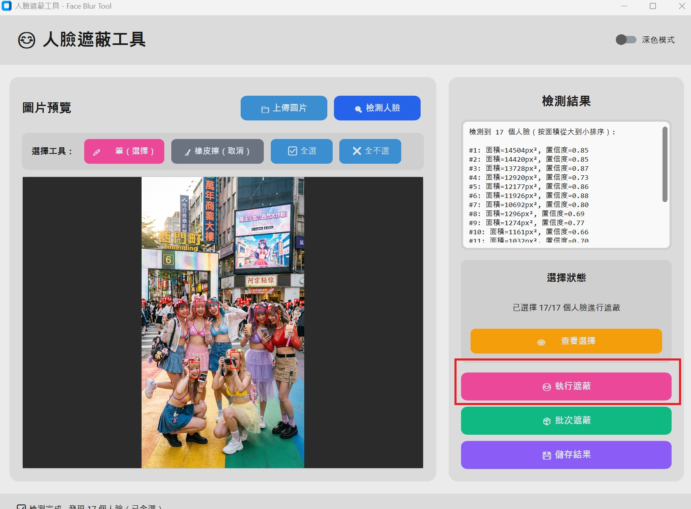
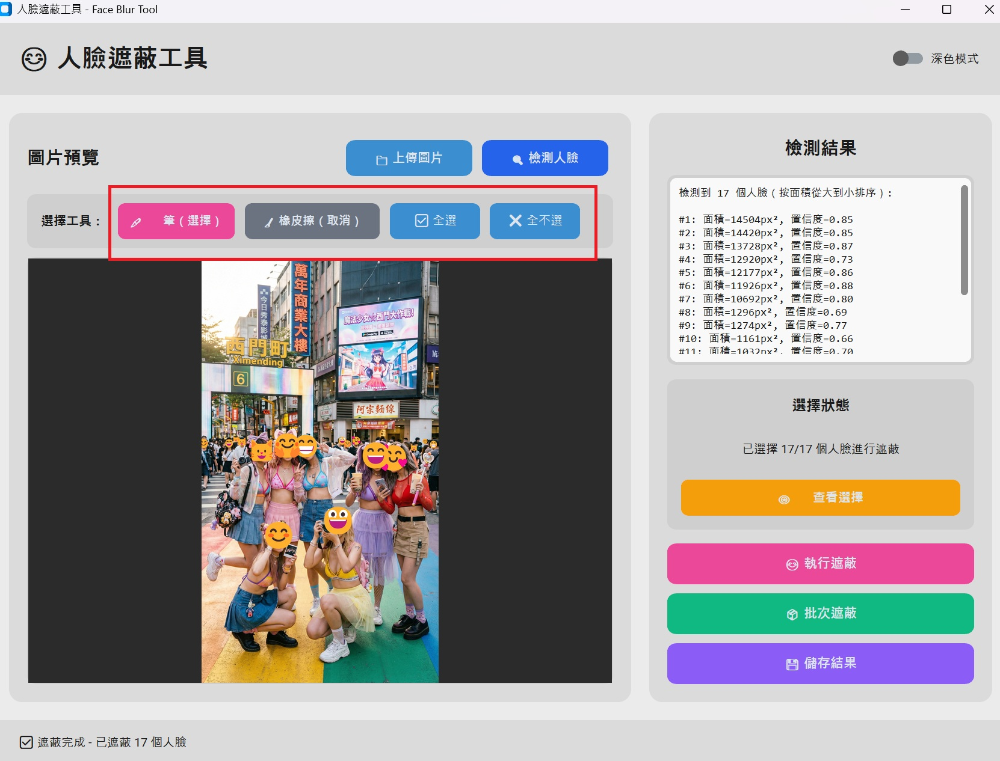
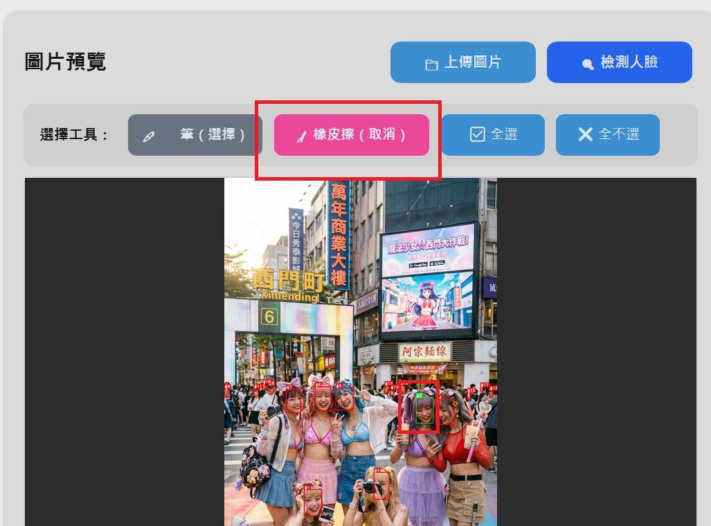
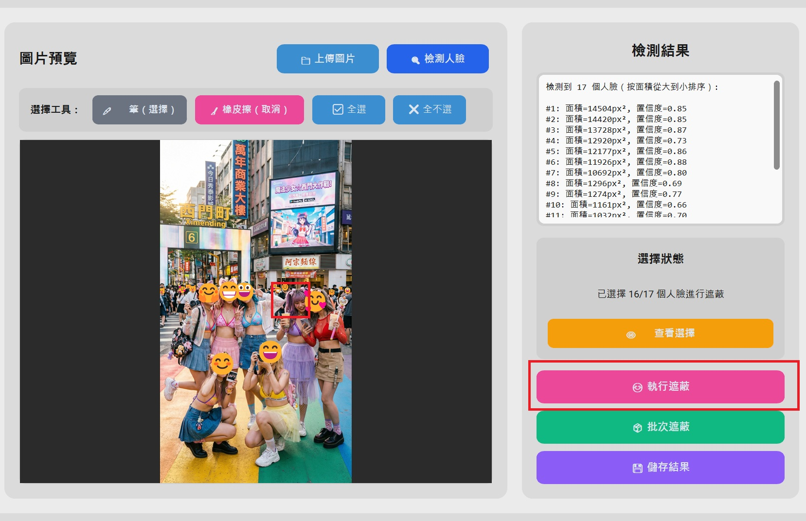

# 😊 SimpleFaceBlur - 人臉遮蔽工具

基於 Web 的人臉遮蔽工具，使用 YOLO 人臉檢測模型與 Gemini API，提供三種遮蔽模式：Emoji、高斯模糊、AI 卡通化。

**Docker 一鍵部署，支援本地運行與 Gemini API 整合。**

適合需要快速處理圖片隱私保護、創意內容製作的場景。

---

## ✨ 功能特色

### 🎯 核心功能
- **智慧人臉檢測**：採用 YOLO 模型，精準識別人臉位置
- **三種遮蔽模式**：
  - 😊 **Emoji 遮蔽**：使用可愛表情符號遮蔽人臉
  - 🌫️ **高斯模糊**：專業級模糊效果保護隱私
  - 🍌 **AI 卡通化**：使用 Gemini API 將選定人臉轉換為卡通風格
- **互動式選擇**：點擊選擇要處理的人臉，靈活控制
- **批次處理**：一次處理整個資料夾的圖片
- **即時預覽**：操作前即時查看效果

### 🛡️ 隱私保護
- ✅ Docker 本地部署
- ✅ 圖片處理在本地進行
- ✅ 卡通化功能可選（需要 Gemini API Key）
- ✅ 開源透明，可自行檢視程式碼

### 💻 技術架構
- 前端：React + TypeScript
- 後端：FastAPI (Python)
- 反向代理：Nginx
- 容器化：Docker Compose
- AI 模型：YOLO + Gemini API

---

## 📋 系統需求

### 最低需求
- **Docker** 與 **Docker Compose**
- **作業系統**：Linux、macOS、Windows (含 WSL2)
- **記憶體**：建議 4GB 以上
- **網路**：僅卡通化功能需要連接 Gemini API

### 選用配置
- **Gemini API Key**：啟用 AI 卡通化功能（可選）
- **GPU 支援**：未來可加速 YOLO 推理（目前使用 CPU）

---

## 🚀 快速開始

### 1. 克隆專案

```bash
git clone https://github.com/your-username/SimpleFaceBlur.git
cd SimpleFaceBlur
```

### 2. 設定環境變數（選用）

如果要使用 AI 卡通化功能，需要設定 Gemini API Key：

```bash
cp .env.example .env
# 編輯 .env 檔案，填入你的 GEMINI_API_KEY
```

`.env` 檔案內容：
```bash
GEMINI_API_KEY=your_api_key_here
GEMINI_MODEL=gemini-3-pro-image-preview
```

### 3. 啟動服務

```bash
docker-compose up --build
```

### 4. 開啟瀏覽器

前往 http://localhost:8904

---

## 📖 使用說明

### 基本操作流程

1. **上傳圖片**
   - 點擊「📁 上傳圖片」選擇要處理的照片

2. **檢測人臉**
   - 點擊「🔍 檢測人臉」進行臉部辨識
   - 系統會自動標記所有檢測到的人臉

3. **選擇人臉**
   - 使用 ✏️ 筆工具選擇要處理的人臉（紅框）
   - 使用 🧹 橡皮擦取消選擇（綠框）
   - 快速操作：☑️ 全選 / ✖️ 全不選

4. **選擇模式**
   - 😊 **表情符號**：用 Emoji 遮蔽人臉
   - 🌫️ **高斯模糊**：模糊化處理
   - 🍌 **卡通化**：AI 生成卡通風格（需要 Gemini API）

5. **預覽與執行**
   - 點擊「👁️ 查看選擇」預覽效果
   - 點擊「😊 執行遮蔽」進行處理

6. **儲存結果**
   - 點擊「💾 儲存結果」下載處理後的圖片
   - 檔案會儲存到 `output/` 目錄

---

## 📖 使用說明

### 基本操作流程

#### 1. 啟動軟體

啟動後會看到現代化的圖形介面：


*圖：初始介面，點擊「上傳圖片」和「檢測人臉」開始*

---

#### 2. 上傳圖片並檢測人臉

1. 點擊 **📁 上傳圖片** 選擇要處理的圖片
2. 點擊 **🔍 檢測人臉** 進行臉部偵測
3. 檢測完成後，所有人臉會自動標記為「要遮蔽」（紅框）

---

#### 3. 執行遮蔽

點擊 **😊 執行遮蔽**，所有選中的人臉會被可愛的 Emoji 遮蔽：



*圖：執行遮蔽後，人臉被 Emoji 覆蓋*

---

#### 4. 遮蔽完成

遮蔽完成後的效果：


*圖：遮蔽完成，可以進行進一步調整*

---

### 🖊️ 互動式選擇（進階功能）

如果您需要**選擇性遮蔽**（例如只遮蔽部分人臉），可以使用互動式選擇功能。

#### 使用工具列

在圖片預覽區域上方，您會看到工具列：



*圖：工具列包含筆、橡皮擦、全選、全不選按鈕*

**工具說明**：
- **🖊️ 筆（選擇）**：點擊人臉以選擇遮蔽
- **🧹 橡皮擦（取消）**：點擊人臉以取消遮蔽
- **✅ 全選**：選擇所有人臉
- **❌ 全不選**：清除所有選擇

---

#### 選擇性遮蔽範例

**情境**：假設您想要保留某個人臉不遮蔽（例如紫色魔法少女）

**步驟 1：選擇橡皮擦工具**

點擊 **🧹 橡皮擦**

**步驟 2：點擊要取消的人臉**

點擊紫色魔法少女，人臉框會從紅色變為綠色：



*圖：使用橡皮擦點擊後，框變為綠色（不遮蔽）*

**視覺反饋說明**：
- **🔴 紅框** = 將被遮蔽
- **🟢 綠框** = 不遮蔽
- **🟡 黃框** = 滑鼠懸停狀態

**步驟 3：再次執行遮蔽**

點擊 **😊 執行遮蔽**，綠框的人臉不會被遮蔽：



*圖：再次遮蔽後，紫色魔法少女的臉保持清晰*

**步驟 4：儲存結果**

點擊 **💾 儲存結果**，選擇儲存位置：


*圖：最終儲存的結果*

---

### 📦 批次處理

批次處理功能可以一次處理多張圖片，適合需要大量處理的場景。

#### 使用方式

1. **點擊批次遮蔽按鈕**

   點擊右側控制面板的 **📦 批次遮蔽**

2. **選擇多張圖片**

   - 使用檔案選擇對話框
   - 按住 `Ctrl`（Windows）或 `Cmd`（macOS）可多選
   - 支援格式：JPG、PNG、BMP

3. **確認警告**

   系統會顯示警告對話框：
   ```
   即將批次處理 X 張圖片

   ⚠️ 警告：批次模式會自動遮蔽所有檢測到的人臉
   處理後的圖片將保存在原圖片目錄，檔名加上 _blurred 後綴

   確定要繼續嗎？
   ```

4. **等待處理完成**

   進度視窗會顯示：
   - 當前處理的檔案名稱
   - 進度條
   - 處理進度（X/Y）

5. **查看結果**

   處理完成後會顯示摘要：
   - 成功處理的圖片數量
   - 失敗的圖片及錯誤訊息

#### 輸出檔案

- **命名規則**：`原檔名_blurred.ext`
- **儲存位置**：原圖片所在目錄
- **範例**：
  - `photo.jpg` → `photo_blurred.jpg`
  - `image.png` → `image_blurred.png`

#### ⚠️ 注意事項

- 批次模式會遮蔽**所有檢測到的人臉**，無法選擇性遮蔽
- 如需選擇性遮蔽，請使用單張圖片的互動式選擇功能
- 建議先備份原始圖片

---

## 🎨 視覺反饋說明

### 人臉框顏色

在互動式選擇模式中，人臉框有三種顏色：

| 顏色 | 狀態 | 說明 |
|------|------|------|
| 🔴 **紅色** | 已選中 | 執行遮蔽時會被遮蔽 |
| 🟢 **綠色** | 未選中 | 執行遮蔽時不會被遮蔽 |
| 🟡 **黃色** | 懸停 | 滑鼠移到人臉上方的提示 |

### 工具按鈕狀態

- **粉紅色按鈕** = 當前選中的工具
- **灰色按鈕** = 未選中的工具

---

## 🔧 技術細節

### 架構

```
專案結構
├── face_blur_onnx.py      # ONNX 推理引擎
├── gui_modern.py          # CustomTkinter 現代化介面
├── main_modern.py         # 主程式入口
├── requirements.txt       # Python 依賴套件
├── Yolo10m/              # YOLO10m 模型資料夾
│   └── model.onnx        # ONNX 模型檔案
└── asset/                # 說明文件圖片
    ├── 01.jpg            # 基本介面
    ├── 02.jpg            # 執行遮蔽
    ├── 03.jpg            # 遮蔽完成
    ├── 04.jpg            # 工具列
    ├── 05.jpg            # 選擇橡皮擦
    ├── 06.jpg            # 選擇性遮蔽結果
    └── 07.jpg            # 儲存結果
```

### 核心技術

- **人臉檢測**：YOLO10m（ONNX Runtime）
- **GUI 框架**：CustomTkinter
- **影像處理**：OpenCV、Pillow
- **模型格式**：ONNX（體積減少 90%）

### 依賴套件

```
onnxruntime>=1.16.0    # ONNX 模型推理
opencv-python>=4.8.0   # 影像處理
Pillow>=10.0.0         # 圖片載入與顯示
numpy>=1.24.0          # 數值運算
customtkinter>=5.2.0   # 現代化 UI 介面
```

### 模型資訊

- **模型**：YOLO10m
- **格式**：ONNX
- **輸入尺寸**：640x640
- **輸出格式**：[batch, 300, 6] (x1, y1, x2, y2, confidence, class_id)
- **執行環境**：CPU（CPUExecutionProvider）

---

## 🎯 適用場景

### ✅ 適合使用

- 📸 社群媒體照片發布前的隱私保護
- 📄 文件、簡報中的人臉去識別化
- 🏫 教育、研究用途的照片處理
- 🏢 企業內部資料的隱私保護
- 📰 新聞、媒體照片的個資保護

### ⚠️ 限制說明

- **高密度人臉**：單張圖片中超過 40 個人臉時，可能會有少數遺漏
- **側臉/遮擋**：極度側臉或被遮擋的人臉檢測率較低
- **低解析度**：過於模糊或解析度太低的人臉可能無法檢測

---

## 🤝 貢獻指南

歡迎貢獻！如果您想要改進這個專案：

1. Fork 本專案
2. 創建您的功能分支 (`git checkout -b feature/AmazingFeature`)
3. 提交您的變更 (`git commit -m 'Add some AmazingFeature'`)
4. 推送到分支 (`git push origin feature/AmazingFeature`)
5. 開啟 Pull Request

---

## 📝 開發說明

### 從源碼建置

```bash
# 克隆專案
git clone https://github.com/your-username/face-blur-tool.git
cd face-blur-tool

# 安裝依賴
pip install -r requirements.txt

# 執行程式
python main_modern.py
```

### 打包成執行檔

專案提供了多種打包方式，請參考：

- `build_pyinstaller_yolo10m.bat` - PyInstaller 打包
- `build_nuitka_yolo10m.bat` - Nuitka 打包（更小的檔案大小）

---

## ❓ 常見問題

### Q: 為什麼 Emoji 顯示不出來？
**A:** 確保系統安裝了 Emoji 字型。Windows 10+ 通常自帶 `seguiemj.ttf`，程式會自動尋找。

### Q: 檢測不到人臉怎麼辦？
**A:**
- 確保圖片清晰，人臉可見
- 人臉不要太小或太側
- 光線充足的照片檢測率較高

### Q: 打包的執行檔很大？
**A:** 這是正常的，因為包含了 ONNX 模型和所有依賴庫。使用 Nuitka 打包可以減小檔案大小。

### Q: 能否修改 Emoji？
**A:** 可以！編輯 `face_blur_onnx.py` 中的 `self.emojis` 列表，添加您喜歡的 Emoji。

### Q: 批次處理時可以選擇性遮蔽嗎？
**A:** 批次模式會自動遮蔽所有人臉。如需選擇性遮蔽，請使用單張圖片的互動式選擇功能。

---

## 🐛 問題回報

如果您遇到任何問題或有建議，請：

1. 前往 [Issues](../../issues) 頁面
2. 搜尋是否有相同問題
3. 如果沒有，請建立新的 Issue，並提供：
   - 作業系統版本
   - Python 版本（如適用）
   - 錯誤訊息截圖
   - 重現步驟

---

## 📜 授權資訊

本專案採用開源授權，詳見 LICENSE 檔案。

### 第三方資源

- **YOLO10m 模型**：請遵循原始授權條款
- **CustomTkinter**：MIT License
- **OpenCV**：Apache License 2.0
- **ONNX Runtime**：MIT License

---

## 🙏 致謝

- YOLO10m 模型提供者
- CustomTkinter 開發團隊
- 所有貢獻者和使用者

---

## 更新日誌

### v2.0.0 (2025-12-27)
- ✨ **重大更新**：全新互動式選擇功能
- ✨ 新增批次處理功能
- 🎨 現代化 UI（CustomTkinter）
- ⚡ 使用 ONNX Runtime，體積減少 90%
- 🖱️ 工具列：筆、橡皮擦、全選、全不選
- 🎨 視覺反饋：紅框（遮蔽）、綠框（不遮蔽）、黃框（懸停）
- 📊 進度視窗顯示批次處理進度

### v1.0.0
- ✅ 初始版本發布
- ✅ YOLOv8 人臉檢測
- ✅ Emoji 遮蔽功能
- ✅ 基本 GUI 介面

---

<div align="center">

**⭐ 如果這個專案對您有幫助，請給個星星支持一下！ ⭐**

Made with ❤️ by Open Source Community

</div>
